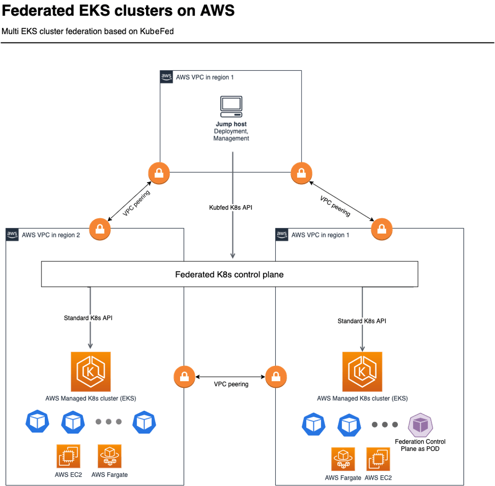

# Federated Amazon EKS Clusters on AWS

The solution demonstrates federation capabilities between two Amazon EKS (Elastic Kubernetes Service) clusters through a secured VPC peering connection. Federation is done by using the official [Kubernetes KubeFed project](https://github.com/kubernetes-sigs/kubefed). The following scenarios could benefit from Amazon EKS cluster’s federation but not limited to them:

- Applications that need high availability, resilient, and automatic scaling functionality between EKS clusters. Kubernetes federation could automatically detect failures of clusters and compensate the number of lost replicas in federated applications across all clusters including the ones in different regions. That would help with keeping compute power on the same level using cross-cluster scheduling features.
- Kubernetes Federation could be useful for hybrid scenarios when building an application layer with data residency, locality, and low latency requirements. For example, you can build applications that will have a subset of services responsible for private data processing within the country and the rest of the services in other EKS clusters.
- Federation is also helping keep in sync and distribute configurations for applications, services, policies to multiple EKS clusters. But we highly recommend using the best practices of staging environment or partial deployment to avoid mass misconfigurations.

## Architecture

Deploying this solution builds the following environment in the AWS Cloud.
<p align="center">

</p>

As a first step solution template deploys jump host in new VPC and provision all the necessary resources:

- VPC
- Public and private subnets
- NAT Gateway
- Internet Gateway
- EC2 for jump host

After login into the jump host and executes the deployment script the following items will be deployed:

- Two VPCs for EKS clusters in selected regions.
- Two AWS EKS clusters in different AWS regions, each in its own VPC without distance limitation.
- VPC peering between three VPCs for secure communication between jump host and Federation control panel with all federated Amazon EKS clusters.
- Federation control panel is a regular pod in one of AWS EKS clusters and act as proxy between Kubernetes administrator and all deployed AWS EKS clusters.

The jump host acts as single point of administration for Amazon EKS, Kubernetes resources and also as single point of deployment and configuration.

## Deployment

To launch the solution follow the step-by-step instructions in the Implementation Guide:
https://docs.aws.amazon.com/solutions/latest/federated-amazon-eks-clusters-on-aws/


## Uninstall resources
You can use the **eksfedctl** tool that is provisioned on bastion host after deployment to automatically cleanup all the solution’s resources. The tool uses a preconfigured .env file (stored in the /home/ssm-user folder) that includes all the necessary parameters for a deletion. 
```
eksfedctl destroy -f {full path to .env file}  (e.g. ~/{stack name}.env or /home/ssm-user/{stack name}.env)
```
Example: 
```
eksfedctl destroy -f ~/eks-fed-10.env
```

Detailed instruction published here:
https://docs.aws.amazon.com/solutions/latest/federated-amazon-eks-clusters-on-aws/

---

Copyright 2021 Amazon.com, Inc. or its affiliates. All Rights Reserved.

Licensed under the Apache License Version 2.0 (the "License"). You may not use this file except in compliance with the License. A copy of the License is located at
http://www.apache.org/licenses/
or in the "license" file accompanying this file. This file is distributed on an "AS IS" BASIS, WITHOUT WARRANTIES OR CONDITIONS OF ANY KIND, express or implied. See the License for the specific language governing permissions and limitations under the License.
